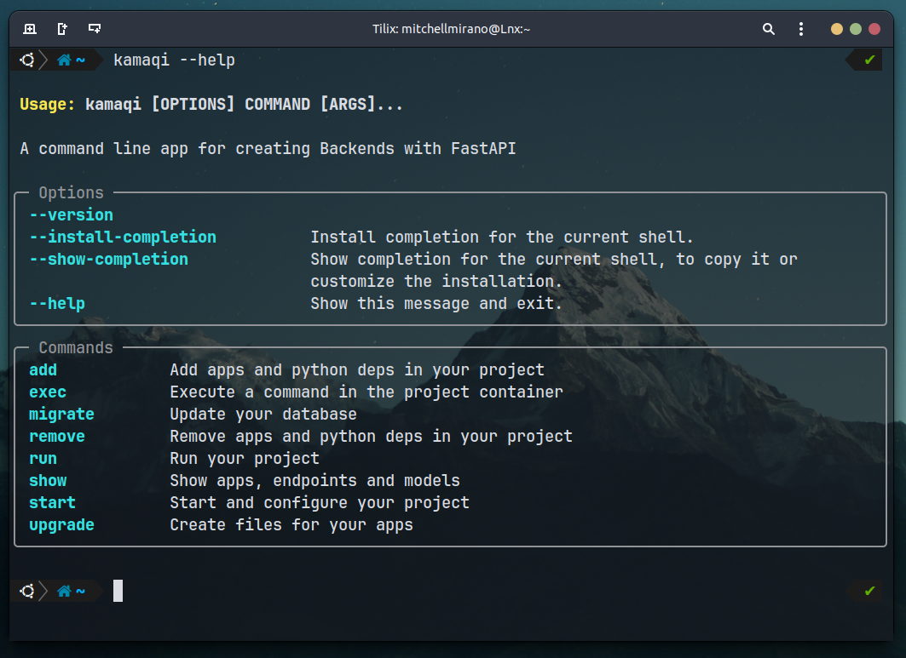

# **Kamaqi**
A command line app for creating Backends with **FastAPI**, inspired in **Artisan** from **Laravel** and **manage.py** from **Django**.



# **Content**
- [The key features are](#the-key-features-are)
- [Installation](#installation)
- [Basic usage](#basic-usage)
- [Project Status](#project-status)

## **The key features are:**

- Creates a normal project or a project with **Docker** and **docker-compose**.
- Chooses a **MySQL**, **PostgreSQL** or **SQLite** database.
- Works as with **Django** creating  apps.
- Every application created with **Kamaqi** contains a minimum **CRUD**.
- Integration between **SQLAlchemy** and **Alembic** for migrations.

### **What is an app?**
An application is a module of your project, which manages the logic of an actor of your application, for example (users, products, shops ... etc). Generally, an app is associated with a table in the database on which you want to do CRUD operations and they are named in the plural.


Every app created with Kamaqi contains the following
files. For example:

```bash
users
├── crud.py
├── router.py
└── schemas.py
```
- The **schemas.py** file contains classes of validation for input and output  data using
Pydantic. For example:

```python
from pydantic import BaseModel,EmailStr

class UserCreate(BaseModel):
    name:str
    email:EmailStr
    password:str

class UserRead(BaseModel):
    id:int
    name:str
    email:EmailStr
```
- The **router.py** contains an APIRouter and endpoint functions. for example:
```python
from fastapi import APIRouter,Depends,status
from users.schemas import UserCreate
from users.schemas import UserRead
from users.crud import insert_user

from sqlalchemy.orm import Session
from database.database import get_db

users_routes= APIRouter(prefix="/api/v1/users")

@users_routes.post(path="/create/",
                 tags=["Users"],
                 response_model=UserRead,
                 status_code=status.HTTP_201_CREATED)
async def create_user(user_data:UserCreate,
                      db:Session=Depends(get_db)):

    return insert_user(db,user_data)
```

- The **crud.py** contains a CRUD functions for your modules as insert_app, update_app, select_app ... etc. For example:

```python
from users.schemas import UserCreate
from sqlalchemy.orm import Session
from database import models

def insert_user(db: Session, 
                user:UserCreate):

    db_user = models.User(**user.dict())
    db.add(db_user)
    db.commit()
    db.refresh(db_user)

    return db_app
```
This is just an example, in a real development environment, before
inserting the user into the database should encrypt the password, check if the user is not registered...etc.

### **Project Structure**

When working on a project with Kamaqi, it can have the following structures.

It is very important to follow those structures to create applications, perform migrations, run your project and use all **Kamaqi** commands.

Otherwise you could build the applications in an unwanted directory, not find the models.py file to add the models to, and also the migrations could fail.

Let's remember that **FastAPI** is a microframework and therefore doesn't give you a project structure like **Django** would. That is why we are free to structure our project as we want.

**Kamaqi** is a tool that will help you streamline your development processes, but in return you must respect its structure. For this reason we chose a structure similar to that of **Django** since this is a very mature framework and its way of working is one of the best.

If you have suggestions for a better project structure or would like to contribute to the development of Kamaqi by adding new features, you can visit [Kamaqi GitHub](https://github.com/Mitchell-Mirano/kamaqi).


- The projects with **Docker** following the next structure.

```bash
project_name
├── db_volume
├── docker-compose.yaml
├── Dockerfile
├── kamaqi.json
├── requirements.txt
└── src
    ├── alembic.ini
    ├── database
    │   ├── database.py
    │   ├── models.py
    ├── main.py
    ├── .env
    ├── migrations
    │   ├── env.py
    │   ├── script.py.mako
    │   └── versions
    ├── users
    │   ├── crud.py
    │   ├── router.py
    │   └── schemas.py
    .
    .
    .
    └── project_name
        ├── auth.py
        ├── exceptions.py
        ├── router.py
        ├── schemas.py
        └── settings.py
```
- The normal projects following the nex structure.

```bash 
project_name
├── alembic.ini
├── database
│   ├── database.py
│   └── models.py
├── env
├── kamaqi.json
├── main.py
├── .env
├── migrations
│   ├── env.py
│   ├── script.py.mako
│   └── versions
├── requirements.txt
├── users
│   ├── crud.py
│   ├── router.py
│   └── schemas.py
.
.
.
└── project_name
    ├── auth.py
    ├── exceptions.py
    ├── router.py
    ├── schemas.py
    └── settings.py
```
- In the projects with docker **db_volume/** is the directory where is saved your database data.

- The **Kamaqi.json** file contains the metadata of your project, this file is very important because **Kamaqi** uses it to execute some commands.

- In normal projects the **env/** directory is the
**Python** virtual environment.

- The **.env** file contains the environment
variables.

- The **migrations/** directory contains the settings for make migrations with **Alembic**.

- The **project_name/** is the main app in to the project.

- **project_name/auth.py** contains functions for hashing passwords, verify passwords and create access tokens. 

- **project_name/exceptions.py** contains some exceptions.

- **project_name/settings.py** contains classes and functions that provide environment variables like secret keys, database connection parameters...etc. These variables are taken from the .env file.

- **database/database.py** contains code for connecting to the database.

- **database/models.py** contains your database models created with **SQLALchemy**, when your creates a new **app** kamaqi create a new basica model in the **models.py** file.


## **Installation**

### **Previous requirements**
- **Python 3.10** or higher.

- **Kamaqi** is now developed and tested in Ubuntu and other Linux distributions.

- If you use **Windows** is recommended has installed **WSL**.

- Note: You can contribute to the development of **Kamaqi** by testing its operation in **Windows** and reporting possible errors to improve the tool.

Install Kamaqi in the global environment.
```bash 
pip3 install kamaqi
```

## **Basic Usage**

For help on Kamaqi commands and parameters, use.
```bash
kamaqi --help 
kamaqi command --help
```
### **Start your project**

- Start project in a new directory
```bash
kamaqi start project project_name
```
- Start project in the current directory
```bash
kamaqi start project .
```
- Choose the options, for setting your project.

- If you choose a normal project and you don't have **MySQL** or **PostgreSQL** installed. it is recommended to select **SQLite** database.

- Remember for create projects with docker requires **docker** and **docker-compose** installed.

### **Run your project**

```bash
cd project_name
```
Execute the following commands
```bash
kamaqi run project
```
or 
```bash
kamaqi run project --build
```
If you works with docker the **--build** option makes a new image of your project before running. 

This is useful if you added a python library to your project when your container was running and you don't want the library to be lost on the next run, because the library is not found in the image.

For more information review [add a Python library](#adding-a-python-library-to-your-project) to your project.

- Explore the FastAPI documentation.
- For Kamaqi the default port is the 8000.
- Open in your browser http://localhost:8000/docs


### **Add apps to your project**
Add an app 
```bash
kamaqi add app users
```
Add multiple apps
```bash
kamaqi add apps users products sales ... etc
```
### **Create files for your apps**
```bash
Kamaqi upgrade apps 
```
- Refresh files in your editor.
- Refresh the FastAPI documentation.
- Review the the **main.py** file.

### **Review your project settings**
```bash
kamaqi show config
```
### **Review your project apps**
```bash
kamaqi show apps
```
### **Database migrations**

For update your database tables.
```bash
kamaqi migrate tables -m"A small description about your changes in database/models.py"
```
### **Connecting to database**

- For projects with Docker, review the **docker-compose.yaml**
and use the database environment variables
or use the following parameters.
```bash
DATABASE_HOST = localhost or project_name_db
DATABASE_USER = project_name_user
DATABASE_PASSWORD = project_name_password
DATABASE_NAME = project_name_db
DATABASE_PORT = MySQL 3306  and PostgreSQL 5432
```
- For normal projects use your settings and in the .env and edit the connection parameters.

- For SQLite databases use a editor extension or a other 
software.

### Adding a Python library to your project

```bash
kamaqi add dep python_library_name
```
or 
```bash
kamaqi add deps python_library_name1 python_library_name2
```
- In normal projects this comand add the **python_library_name** to the virtual environment(env)
and updates the requirements.txt file.

- In proyects with docker this command  add the
**python_library_name** to the project container and
updates the requirements.txt file.
Then when you use the **--build** the new image of your project will be build with the new libraries.

### Removing a Python library to your project

```bash
kamaqi remove dep python_library_name
```
or 
```bash
kamaqi remove deps python_library_name1 python_library_name2
```
- In normal projects this comand removes the **python_library_name** in the virtual environment(env)
and updates the requirements.txt file.

- In proyects with docker this command  removes the
**python_library_name** in the project container and
updates the requirements.txt file.
Then when you use the **--build** the new image of your project will be build with the new libraries.

### Executing a command in your project container

```bash
kamaqi exec "any Linux command" 
```
- **Kamaqi** use the **Ubuntu:latest** version to build your project image. For this reason you can execute any command of **Ubuntu**.

- Remember that any change in the container at runtime will not be reflected in the project image.

- This method is not recommended for adding python libraries to the container as it will not update the requirements.txt file

## Project Status
- The project is currently under development and may contain errors.

- You can contribute to this project, reporting bugs, writing documentation, writing tests, with pull requests... etc.

For more information, visit [GitHub repository](https://github.com/Mitchell-Mirano/kamaqi)


